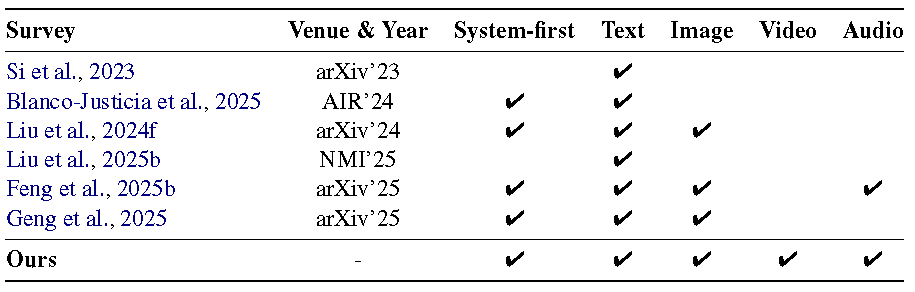
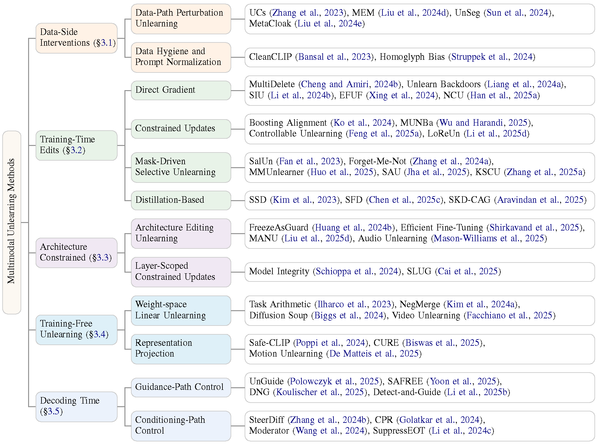
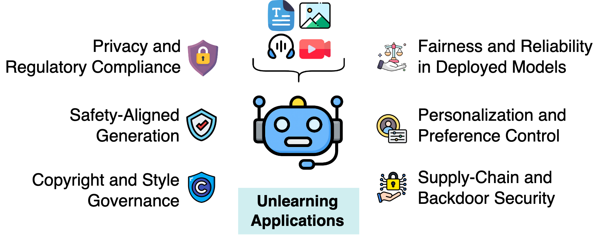

<h1 align="center">
  Multimodal Unlearning Across Vision, Language, Video, and Audio: Survey of Methods, Datasets, and Benchmarks
</h1>

<div align="center">
<a href="https://doi.org/10.36227/techrxiv.176945748.88280394/v1"></a>&nbsp;<!--
--><a href="https://www.techrxiv.org/"></a>&nbsp;<!--
--><a href="https://github.com/smsnobin77/Awesome-Multimodal-Unlearning/pulls"></a>
</div>
&nbsp;
                                                                                 
> **Authors**: Nobin Sarwar<sup>🏫</sup>, Shubhashis Roy Dipta<sup>🏫</sup>, Zheyuan Liu<sup>🎓</sup>, Vaidehi Patil<sup>🏛️</sup>  
>
> **Affiliations**: <sup>🏫</sup> University of Maryland, Baltimore County &nbsp;·&nbsp; <sup>🎓</sup> University of Notre Dame &nbsp;·&nbsp; <sup>🏛️</sup> UNC Chapel Hill

> We welcome issues for any related work not discussed and will consider inclusion in future updates.

## 🎉 Latest News

- **[2026-02-14]** 🚀 We launch the **Awesome Multimodal Unlearning** repository to track methods, datasets, and benchmarks. Check it out: [GitHub](https://github.com/smsnobin77/Awesome-Multimodal-Unlearning)  
- **[2026-01-26]** 📄 Our survey on **Multimodal Unlearning** is released on TechRxiv. See the paper: [TechRxiv](http://dx.doi.org/10.36227/techrxiv.176945748.88280394/v1)

## 📌 Citation

If our work supports your research or applications, we would appreciate a ⭐ and a citation using the BibTeX below.

```bibtex
@article{sarwar2026mm-unlearning-survey,
  title = {{Multimodal Unlearning Across Vision, Language, Video, and Audio: Survey of Methods, Datasets, and Benchmarks}},
  author = {Sarwar, Nobin and Roy Dipta, Shubhashis and Liu, Zheyuan and Patil, Vaidehi},
  year = {2026},
  doi = {10.36227/techrxiv.176945748.88280394/v1},
  url = {https://doi.org/10.36227/techrxiv.176945748.88280394/v1},
  publisher = {Institute of Electrical and Electronics Engineers (IEEE)},
  month = jan
}
```

## 📚 Contents  
- [Latest News](#-latest-news)
- [Citation](#-citation)
- [Overview](#-overview)
- [Comparison with Existing Surveys](#-comparison-with-existing-surveys)
- [Taxonomy of Multimodal Unlearning](#-taxonomy-of-multimodal-unlearning)
- [Benchmarks for Multimodal Unlearning](#-benchmarks-for-multimodal-unlearning)
- [Evaluation Metrics](#-evaluation-metrics)
- [Applications of Multimodal Unlearning](#-applications-of-multimodal-unlearning)
- [Curated Paper List](#-curated-paper-list)
  - [Vision-Language Models (VLMs)](#vision-language-models-vlms)
  - [Diffusion Models (DMs)](#diffusion-models-dms)
- [Contact](#-contact)

## 🧭 Overview  

Multimodal unlearning requires identifying effective intervention points within the model pipeline. Figure 2 illustrates methods spanning data-side, training-time, architecture-constrained, and decoding-time stages, producing an updated model (MFM′). Training-free approaches instead apply direct parameter or representation edits (Δ).

<p align="center">
  
  <br/>
  <span style="font-size: 10px;">Figure 2: <b>System-level intervention points</b> for multimodal unlearning across the model pipeline.</span>
</p>

## 📊 Comparison with Existing Surveys

<p align="center">
  
  <br/>
  <span style="font-size: 10px;">Table 1: Comparison of multimodal unlearning surveys <br> across <b>modalities</b> and <b>system-first taxonomy</b> coverage.</span>
</p>

While several surveys address multimodal unlearning (Table 1), most focus on unimodal or limited text–image settings, and adopt algorithm-centric taxonomies that obscure practical intervention points. **A unified cross-modal perspective remains lacking**; key references are listed below. 

- **Si et al., 2023** — Knowledge Unlearning for LLMs: Tasks, Methods, and Challenges [](https://arxiv.org/pdf/2311.15766)

- **Blanco-Justicia et al., 2025** — Digital Forgetting in Large Language Models: A Survey of Unlearning Methods [](https://arxiv.org/pdf/2404.02062)

- **Liu et al., 2024f** — Machine Unlearning in Generative AI: A Survey [](https://arxiv.org/pdf/2407.20516)

- **Liu et al., 2025b** — Rethinking Machine Unlearning for Large Language Models [](https://arxiv.org/pdf/2402.08787)

- **Feng et al., 2025b** — A Survey on Generative Model Unlearning: Fundamentals, Taxonomy, Evaluation, and Future Direction [](https://arxiv.org/pdf/2507.19894)

- **Geng et al., 2025b** — A Comprehensive Survey of Machine Unlearning Techniques for Large Language Models [](https://arxiv.org/pdf/2503.01854)


## 📂 Taxonomy of Multimodal Unlearning

We organize multimodal unlearning via a **system-first taxonomy** across **five** intervention stages:

- **Data-Side Interventions (Section 3.1)** – Modify inputs or data distributions to reduce learnability of target content.  
- **Training-Time Edits (Section 3.2)** – Update model parameters to suppress target behavior.  
- **Architecture-Constrained Unlearning (Section 3.3)** – Localized updates within layers or structures.
- **Training-Free Unlearning (Section 3.4)** – Apply closed-form parameter or representation edits without retraining.  
- **Decoding-Time Unlearning (Section 3.5)** – Control generation without modifying model parameters.  

<p align="center">
  
  <br/>
  <span style="font-size: 10px;">Figure 1: Taxonomy of multimodal unlearning by <b>intervention stage</b> and <b>control pathway</b>.</span>
</p>

## 📈 Benchmarks for Multimodal Unlearning  

We organize representative multimodal unlearning benchmarks into **three** categories: **unified suites**, **identity and privacy**, and **content and knowledge**, based on their targets and evaluation focus (Table 3).

**🧪 Unified Benchmark Suites**
- MU-Bench: A Multitask Multimodal Benchmark for Machine Unlearning [](https://arxiv.org/pdf/2406.14796)

- Protecting Privacy in Multimodal Large Language Models with MLLMU-Bench [](https://arxiv.org/pdf/2410.22108)

- PEBench: A Fictitious Dataset to Benchmark Machine Unlearning for Multimodal Large Language Models [](https://arxiv.org/pdf/2503.12545)

- UMU-Bench: Closing the Modality Gap in Multimodal Unlearning Evaluation [](https://openreview.net/pdf?id=M476xkfNXe)

**🔐 Identity and Privacy Unlearning**
- CLEAR: Character Unlearning in Textual and Visual Modalities [](https://arxiv.org/pdf/2410.18057)

- Benchmarking Vision Language Model Unlearning via Fictitious Facial Identity Dataset [](https://arxiv.org/pdf/2411.03554)

- Alexa, can you forget me? Machine Unlearning Benchmark in Spoken Language Understanding [](https://arxiv.org/pdf/2505.15700)

**📚 Content and Knowledge Unlearning**
- A Dataset and Benchmark for Copyright Infringement Unlearning from Text-to-Image Diffusion Models [](https://arxiv.org/pdf/2403.12052)

- UnlearnCanvas: Stylized Image Dataset for Enhanced Machine Unlearning Evaluation in Diffusion Models [](https://arxiv.org/pdf/2402.11846)

- Holistic Unlearning Benchmark: A Multi-Faceted Evaluation for Text-to-Image Diffusion Model Unlearning [](https://arxiv.org/pdf/2410.05664)

- Six-CD: Benchmarking Concept Removals for Text-to-image Diffusion Models [](https://arxiv.org/pdf/2406.14855)

- Single Image Unlearning: Efficient Machine Unlearning in Multimodal Large Language Models [](https://arxiv.org/pdf/2405.12523)

- Unlearning Sensitive Information in Multimodal LLMs: Benchmark and Attack-Defense Evaluation [](https://arxiv.org/pdf/2505.01456)

- SafeEraser: Enhancing Safety in Multimodal Large Language Models through Multimodal Machine Unlearning [](https://arxiv.org/pdf/2502.12520)
  
## 📏 Evaluation Metrics  

Evaluation uses metric suites that assess forgetting, utility retention, robustness, and efficiency, as summarized in **Figure 3**. We defer detailed metric definitions and evaluation protocols to **Appendix C**.

<p align="center">
  
  <br/>
  <span style="font-size: 10px;">Figure 3: Evaluation dimensions and representative metrics for multimodal unlearning.</span>
</p>

## 🧩 Applications of Multimodal Unlearning  

Multimodal unlearning enables selective removal of specific identities, attributes, or concepts without full retraining while preserving overall capability and stability. Detailed use cases and representative studies are provided in **Appendix F**.

<p align="center">
  
  <br/>
  <span style="font-size: 10px;">Figure 4: Core application scenarios of multimodal unlearning.</span>
</p>


## 📑 Curated Paper List  

We curate **111 papers**, comprising **55 on Vision-Language Models (VLMs)** and **56 on Diffusion Models (DMs)**, to provide a structured overview of recent advances in multimodal machine unlearning.

### Vision-Language Models (VLMs)

| Date | Title | Paper |
|------|-------|-------|
| 2025-12 | UMU-Bench: Closing the Modality Gap in Multimodal Unlearning Evaluation | [](https://openreview.net/pdf?id=M476xkfNXe) |
| 2025-09 | No Encore: Unlearning as Opt-Out in Music Generation | [](https://arxiv.org/pdf/2509.06277) |
| 2025-08 | Unleashing Uncertainty: Efficient Machine Unlearning for Generative AI | [](https://arxiv.org/pdf/2508.20773) |
| 2025-08 | Unlearning LLM-Based Speech Recognition Models | [](https://www.isca-archive.org/interspeech_2025/liu25b_interspeech.pdf) |
| 2025-07 | Unlearning the Noisy Correspondence Makes CLIP More Robust | [](https://arxiv.org/pdf/2507.03434) |
| 2025-07 | PULSE: Practical Evaluation Scenarios for Large Multimodal Model Unlearning | [](https://arxiv.org/pdf/2507.01271) |
| 2025-07 | Quantum-Inspired Audio Unlearning: Towards Privacy-Preserving Voice Biometrics | [](https://arxiv.org/pdf/2507.22208) |
| 2025-07 | Do Not Mimic My Voice: Speaker Identity Unlearning for Zero-Shot Text-to-Speech | [](https://arxiv.org/pdf/2507.20140) |
| 2025-07 | Automating Evaluation of Diffusion Model Unlearning with (Vision-) Language Model World Knowledge | [](https://arxiv.org/pdf/2507.07137) |
| 2025-06 | Rethinking Post-Unlearning Behavior of Large Vision-Language Models | [](https://arxiv.org/pdf/2506.02541) |
| 2025-06 | Quantifying Cross-Modality Memorization in Vision-Language Models | [](https://arxiv.org/pdf/2506.05198) |
| 2025-06 | Lifting Data-Tracing Machine Unlearning to Knowledge-Tracing for Foundation Models | [](https://arxiv.org/pdf/2506.11253) |
| 2025-06 | SUA: Stealthy Multimodal Large Language Model Unlearning Attack | [](https://www.arxiv.org/pdf/2506.17265) |
| 2025-06 | Speech Unlearning | [](https://arxiv.org/pdf/2506.00848) |
| 2025-05 | Unlearning Sensitive Information in Multimodal LLMs: Benchmark and Attack-Defense Evaluation | [](https://arxiv.org/pdf/2505.01456) |
| 2025-05 | Alexa, can you forget me? Machine Unlearning Benchmark in Spoken Language Understanding | [](https://arxiv.org/pdf/2505.15700) |
| 2025-04 | Prompting Forgetting: Unlearning in GANs via Textual Guidance | [](https://arxiv.org/pdf/2504.01218) |
| 2025-03 | PEBench: A Fictitious Dataset to Benchmark Machine Unlearning for Multimodal Large Language Models | [](https://arxiv.org/pdf/2503.12545) |
| 2025-03 | Safety Mirage: How Spurious Correlations Undermine VLM Safety Fine-Tuning and Can Be Mitigated by Machine Unlearning | [](https://arxiv.org/pdf/2503.11832) |
| 2025-02 | Machine Unlearning in Audio: Bridging the Modality Gap via the Prune and Regrow Paradigm | [](https://openreview.net/pdf?id=i3tBySZWrR) |
| 2025-02 | MMUnlearner: Reformulating Multimodal Machine Unlearning in the Era of Multimodal Large Language Models | [](https://arxiv.org/pdf/2502.11051) |
| 2025-02 | SafeEraser: Enhancing Safety in Multimodal Large Language Models through Multimodal Machine Unlearning | [](https://arxiv.org/pdf/2502.12520) |
| 2025-02 | Modality-Aware Neuron Pruning for Unlearning in Multimodal Large Language Models | [](https://arxiv.org/pdf/2502.15910) |
| 2025-02 | SEMU: Singular Value Decomposition for Efficient Machine Unlearning | [](https://arxiv.org/pdf/2502.07587) |
| 2025-01 | Zero-shot CLIP Class Forgetting via Text-image Space Adaptation | [](https://openreview.net/pdf?id=V2SD2uVKEE) |
| 2025-01 | Rethinking Bottlenecks in Safety Fine-Tuning of Vision Language Models | [](https://arxiv.org/pdf/2501.18533) |
| 2024-11 | Benchmarking Vision Language Model Unlearning via Fictitious Facial Identity Dataset | [](https://arxiv.org/pdf/2411.03554) |
| 2024-10 | CLIPErase: Efficient Unlearning of Visual-Textual Associations in CLIP | [](https://arxiv.org/pdf/2410.23330) |
| 2024-10 | Protecting Privacy in Multimodal Large Language Models with MLLMU-Bench | [](https://arxiv.org/pdf/2410.22108) |
| 2024-10 | CLEAR: Character Unlearning in Textual and Visual Modalities | [](https://arxiv.org/pdf/2410.18057) |
| 2024-10 | NegMerge: Sign-Consensual Weight Merging for Machine Unlearning | [](https://arxiv.org/pdf/2410.05583) |
| 2024-10 | UnSeg: One Universal Unlearnable Example Generator is Enough against All Image Segmentation | [](https://arxiv.org/pdf/2410.09909) |
| 2024-09 | Efficient Backdoor Defense in Multimodal Contrastive Learning: A Token-Level Unlearning Method for Mitigating Threats | [](https://arxiv.org/pdf/2409.19526) |
| 2024-07 | Zero-Shot Class Unlearning in CLIP with Synthetic Samples | [](https://arxiv.org/pdf/2407.07485) |
| 2024-07 | Multimodal Unlearnable Examples: Protecting Data against Multimodal Contrastive Learning | [](https://arxiv.org/pdf/2407.16307) |
| 2024-07 | Direct Unlearning Optimization for Robust and Safe Text-to-Image Models | [](https://arxiv.org/pdf/2407.21035) |
| 2024-07 | Targeted Unlearning with Single Layer Unlearning Gradient | [](https://arxiv.org/pdf/2407.11867) |
| 2024-06 | MU-Bench: A Multitask Multimodal Benchmark for Machine Unlearning | [](https://arxiv.org/pdf/2406.14796) |
| 2024-06 | MUC: Machine Unlearning for Contrastive Learning with Black-box Evaluation | [](https://arxiv.org/pdf/2406.03603) |
| 2024-06 | Can Textual Unlearning Solve Cross-Modality Safety Alignment? | [](https://arxiv.org/pdf/2406.02575) |
| 2024-05 | Single Image Unlearning: Efficient Machine Unlearning in Multimodal Large Language Models | [](https://arxiv.org/pdf/2405.12523) |
| 2024-05 | Multi-Modal Recommendation Unlearning for Legal, Licensing, and Modality Constraints | [](https://arxiv.org/pdf/2405.15328) |
| 2024-05 | Automatic Jailbreaking of the Text-to-Image Generative AI Systems | [](https://arxiv.org/pdf/2405.16567) |
| 2024-03 | Unlearning Backdoor Threats: Enhancing Backdoor Defense in Multimodal Contrastive Learning via Local Token Unlearning | [](https://arxiv.org/pdf/2403.16257) |
| 2024-03 | CLIP the Bias: How Useful is Balancing Data in Multimodal Learning? | [](https://arxiv.org/pdf/2403.04547) |
| 2024-02 | EFUF: Efficient Fine-Grained Unlearning Framework for Mitigating Hallucinations in Multimodal Large Language Models | [](https://arxiv.org/pdf/2402.09801) |
| 2024-02 | Learning the Unlearned: Mitigating Feature Suppression in Contrastive Learning | [](https://arxiv.org/pdf/2402.11816) |
| 2024-02 | Visual In-Context Learning for Large Vision-Language Models | [](https://arxiv.org/pdf/2402.11574) |
| 2023-11 | MultiDelete for Multimodal Machine Unlearning | [](https://arxiv.org/pdf/2311.12047) |
| 2023-11 | Safe-CLIP: Removing NSFW Concepts from Vision-and-Language Models | [](https://arxiv.org/pdf/2311.16254) |
| 2023-11 | BadCLIP: Dual-Embedding Guided Backdoor Attack on Multimodal Contrastive Learning | [](https://arxiv.org/pdf/2311.12075) |
| 2023-03 | CleanCLIP: Mitigating Data Poisoning Attacks in Multimodal Contrastive Learning | [](https://arxiv.org/pdf/2303.03323) |
| 2023-01 | Unlearnable Clusters: Towards Label-agnostic Unlearnable Examples | [](https://arxiv.org/pdf/2301.01217) |
| 2022-12 | Editing Models with Task Arithmetic | [](https://arxiv.org/pdf/2212.04089.pdf) |
| 2022-12 | Pre-trained Encoders in Self-Supervised Learning Improve Secure and Privacy-preserving Supervised Learning | [](https://arxiv.org/pdf/2212.03334) |

- **2025-12** UMU-Bench: Closing the Modality Gap in Multimodal Unlearning Evaluation [](https://openreview.net/pdf?id=M476xkfNXe)

- **2025-09** No Encore: Unlearning as Opt-Out in Music Generation [](https://arxiv.org/pdf/2509.06277)

- **2025-08** Unleashing Uncertainty: Efficient Machine Unlearning for Generative AI [](https://arxiv.org/pdf/2508.20773)

- **2025-08** Unlearning LLM-Based Speech Recognition Models [](https://www.isca-archive.org/interspeech_2025/liu25b_interspeech.pdf)

- **2025-07** Unlearning the Noisy Correspondence Makes CLIP More Robust [](https://arxiv.org/pdf/2507.03434)

- **2025-07** PULSE: Practical Evaluation Scenarios for Large Multimodal Model Unlearning [](https://arxiv.org/pdf/2507.01271)

- **2025-07** Quantum-Inspired Audio Unlearning: Towards Privacy-Preserving Voice Biometrics [](https://arxiv.org/pdf/2507.22208)

- **2025-07** Do Not Mimic My Voice: Speaker Identity Unlearning for Zero-Shot Text-to-Speech [](https://arxiv.org/pdf/2507.20140)

- **2025-07** Automating Evaluation of Diffusion Model Unlearning with (Vision-) Language Model World Knowledge [](https://arxiv.org/pdf/2507.07137)

- **2025-06** Rethinking Post-Unlearning Behavior of Large Vision-Language Models [](https://arxiv.org/pdf/2506.02541)

- **2025-06** Quantifying Cross-Modality Memorization in Vision-Language Models [](https://arxiv.org/pdf/2506.05198)

- **2025-06** Lifting Data-Tracing Machine Unlearning to Knowledge-Tracing for Foundation Models [](https://arxiv.org/pdf/2506.11253)

- **2025-06** SUA: Stealthy Multimodal Large Language Model Unlearning Attack [](https://www.arxiv.org/pdf/2506.17265)

- **2025-06** Speech Unlearning [](https://arxiv.org/pdf/2506.00848)

- **2025-05** Unlearning Sensitive Information in Multimodal LLMs: Benchmark and Attack-Defense Evaluation [](https://arxiv.org/pdf/2505.01456)

- **2025-05** Alexa, can you forget me? Machine Unlearning Benchmark in Spoken Language Understanding [](https://arxiv.org/pdf/2505.15700)

- **2025-04** Prompting Forgetting: Unlearning in GANs via Textual Guidance [](https://arxiv.org/pdf/2504.01218)

- **2025-03** PEBench: A Fictitious Dataset to Benchmark Machine Unlearning for Multimodal Large Language Models [](https://arxiv.org/pdf/2503.12545)

- **2025-03** Safety Mirage: How Spurious Correlations Undermine VLM Safety Fine-Tuning and Can Be Mitigated by Machine Unlearning [](https://arxiv.org/pdf/2503.11832)

- **2025-02** Machine Unlearning in Audio: Bridging the Modality Gap via the Prune and Regrow Paradigm [](https://openreview.net/pdf?id=i3tBySZWrR)

- **2025-02** MMUnlearner: Reformulating Multimodal Machine Unlearning in the Era of Multimodal Large Language Models [](https://arxiv.org/pdf/2502.11051)

- **2025-02** SafeEraser: Enhancing Safety in Multimodal Large Language Models through Multimodal Machine Unlearning [](https://arxiv.org/pdf/2502.12520)

- **2025-02** Modality-Aware Neuron Pruning for Unlearning in Multimodal Large Language Models [](https://arxiv.org/pdf/2502.15910)

- **2025-02** SEMU: Singular Value Decomposition for Efficient Machine Unlearning [](https://arxiv.org/pdf/2502.07587)

- **2025-01** Zero-shot CLIP Class Forgetting via Text-image Space Adaptation [](https://openreview.net/pdf?id=V2SD2uVKEE)

- **2025-01** Rethinking Bottlenecks in Safety Fine-Tuning of Vision Language Models [](https://arxiv.org/pdf/2501.18533)

- **2024-11** Benchmarking Vision Language Model Unlearning via Fictitious Facial Identity Dataset [](https://arxiv.org/pdf/2411.03554)

- **2024-10** CLIPErase: Efficient Unlearning of Visual-Textual Associations in CLIP [](https://arxiv.org/pdf/2410.23330)

- **2024-10** Protecting Privacy in Multimodal Large Language Models with MLLMU-Bench [](https://arxiv.org/pdf/2410.22108)

- **2024-10** CLEAR: Character Unlearning in Textual and Visual Modalities [](https://arxiv.org/pdf/2410.18057)

- **2024-10** NegMerge: Sign-Consensual Weight Merging for Machine Unlearning [](https://arxiv.org/pdf/2410.05583)

- **2024-10** UnSeg: One Universal Unlearnable Example Generator is Enough against All Image Segmentation [](https://arxiv.org/pdf/2410.09909)

- **2024-09** Efficient Backdoor Defense in Multimodal Contrastive Learning: A Token-Level Unlearning Method for Mitigating Threats [](https://arxiv.org/pdf/2409.19526)

- **2024-07** Zero-Shot Class Unlearning in CLIP with Synthetic Samples [](https://arxiv.org/pdf/2407.07485)

- **2024-07** Multimodal Unlearnable Examples: Protecting Data against Multimodal Contrastive Learning [](https://arxiv.org/pdf/2407.16307)

- **2024-07** Direct Unlearning Optimization for Robust and Safe Text-to-Image Models [](https://arxiv.org/pdf/2407.21035)

- **2024-07** Targeted Unlearning with Single Layer Unlearning Gradient [](https://arxiv.org/pdf/2407.11867)

- **2024-06** MU-Bench: A Multitask Multimodal Benchmark for Machine Unlearning [](https://arxiv.org/pdf/2406.14796)

- **2024-06** MUC: Machine Unlearning for Contrastive Learning with Black-box Evaluation [](https://arxiv.org/pdf/2406.03603)

- **2024-06** Can Textual Unlearning Solve Cross-Modality Safety Alignment? [](https://arxiv.org/pdf/2406.02575)

- **2024-05** Single Image Unlearning: Efficient Machine Unlearning in Multimodal Large Language Models [](https://arxiv.org/pdf/2405.12523)

- **2024-05** Multi-Modal Recommendation Unlearning for Legal, Licensing, and Modality Constraints [](https://arxiv.org/pdf/2405.15328)

- **2024-05** Automatic Jailbreaking of the Text-to-Image Generative AI Systems [](https://arxiv.org/pdf/2405.16567)

- **2024-03** Unlearning Backdoor Threats: Enhancing Backdoor Defense in Multimodal Contrastive Learning via Local Token Unlearning [](https://arxiv.org/pdf/2403.16257)

- **2024-03** CLIP the Bias: How Useful is Balancing Data in Multimodal Learning? [](https://arxiv.org/pdf/2403.04547)

- **2024-02** EFUF: Efficient Fine-Grained Unlearning Framework for Mitigating Hallucinations in Multimodal Large Language Models [](https://arxiv.org/pdf/2402.09801)

- **2024-02** Learning the Unlearned: Mitigating Feature Suppression in Contrastive Learning [](https://arxiv.org/pdf/2402.11816)

- **2024-02** Visual In-Context Learning for Large Vision-Language Models [](https://arxiv.org/pdf/2402.11574)

- **2023-11** MultiDelete for Multimodal Machine Unlearning [](https://arxiv.org/pdf/2311.12047)

- **2023-11** Safe-CLIP: Removing NSFW Concepts from Vision-and-Language Models [](https://arxiv.org/pdf/2311.16254)

- **2023-11** BadCLIP: Dual-Embedding Guided Backdoor Attack on Multimodal Contrastive Learning [](https://arxiv.org/pdf/2311.12075)

- **2023-03** CleanCLIP: Mitigating Data Poisoning Attacks in Multimodal Contrastive Learning [](https://arxiv.org/pdf/2303.03323)

- **2023-01** Unlearnable Clusters: Towards Label-agnostic Unlearnable Examples [](https://arxiv.org/pdf/2301.01217)

- **2022-12** Editing Models with Task Arithmetic [](https://arxiv.org/pdf/2212.04089.pdf)

- **2022-12** Pre-trained Encoders in Self-Supervised Learning Improve Secure and Privacy-preserving Supervised Learning [](https://arxiv.org/pdf/2212.03334)

### Diffusion Models (DMs)

- **2025-08** Sealing The Backdoor: Unlearning Adversarial Text Triggers In Diffusion Models Using Knowledge Distillation [](https://arxiv.org/pdf/2508.18235)

- **2025-08** UnGuide: Learning to Forget with LoRA-Guided Diffusion Models [](https://arxiv.org/pdf/2508.05755)

- **2025-08** Steering Guidance for Personalized Text-to-Image Diffusion Models [](https://arxiv.org/pdf/2508.00319)

- **2025-07** LoReUn: Data Itself Implicitly Provides Cues to Improve Machine Unlearning [](https://arxiv.org/pdf/2507.22499)

- **2025-07** Towards Resilient Safety-driven Unlearning for Diffusion Models against Downstream Fine-tuning [](https://arxiv.org/pdf/2507.16302)

- **2025-07** Image Can Bring Your Memory Back: A Novel Multi-Modal Guided Attack against Image Generation Model Unlearning [](https://arxiv.org/pdf/2507.07139)

- **2025-07** Concept Unlearning by Modeling Key Steps of Diffusion Process [](https://arxiv.org/pdf/2507.06526)

- **2025-06** Large-Scale Training Data Attribution for Music Generative Models via Unlearning [](https://arxiv.org/pdf/2506.18312)

- **2025-06** Video Unlearning via Low-Rank Refusal Vector [](https://arxiv.org/pdf/2506.07891)

- **2025-05** CURE: Concept Unlearning via Orthogonal Representation Editing in Diffusion Models [](https://arxiv.org/pdf/2505.12677)

- **2025-04** The Dual Power of Interpretable Token Embeddings: Jailbreaking Attacks and Defenses for Diffusion Model Unlearning [](https://arxiv.org/pdf/2504.21307)

- **2025-04** Backdoor Defense in Diffusion Models via Spatial Attention Unlearning [](https://arxiv.org/pdf/2504.18563)

- **2025-04** Sculpting Memory: Multi-Concept Forgetting in Diffusion Models via Dynamic Mask and Concept-Aware Optimization [](https://arxiv.org/pdf/2504.09039)

- **2025-03** Human Motion Unlearning [](https://arxiv.org/pdf/2503.18674)

- **2025-03** Detect-and-Guide: Self-regulation of Diffusion Models for Safe Text-to-Image Generation via Guideline Token Optimization [](https://arxiv.org/pdf/2503.15197)

- **2025-03** Data Unlearning in Diffusion Models [](https://arxiv.org/pdf/2503.01034)

- **2025-01** SAeUron: Interpretable Concept Unlearning in Diffusion Models with Sparse Autoencoders [](https://arxiv.org/pdf/2501.18052)

- **2024-12** Efficient Fine-Tuning and Concept Suppression for Pruned Diffusion Models [](https://arxiv.org/pdf/2412.15341)

- **2024-12** Boosting Alignment for Post-Unlearning Text-to-Image Generative Models [](https://arxiv.org/pdf/2412.07808)

- **2024-12** Learning to Forget using Hypernetworks [](https://arxiv.org/pdf/2412.00761)

- **2024-11** MUNBa: Machine Unlearning via Nash Bargaining [](https://arxiv.org/pdf/2411.15537)

- **2024-11** Model Integrity when Unlearning with T2I Diffusion Models [](https://arxiv.org/pdf/2411.02068)

- **2024-10** Meta-Unlearning on Diffusion Models: Preventing Relearning Unlearned Concepts [](https://arxiv.org/pdf/2410.12777)

- **2024-10** SAFREE: Training-Free and Adaptive Guard for Safe Text-to-Image And Video Generation [](https://arxiv.org/pdf/2410.12761)

- **2024-10** Holistic Unlearning Benchmark: A Multi-Faceted Evaluation for Text-to-Image Diffusion Model Unlearning [](https://arxiv.org/pdf/2410.05664)

- **2024-10** Unstable Unlearning: The Hidden Risk of Concept Resurgence in Diffusion Models [](https://arxiv.org/pdf/2410.08074)

- **2024-10** SteerDiff: Steering towards Safe Text-to-Image Diffusion Models [](https://arxiv.org/pdf/2410.02710)

- **2024-10** Dynamic Negative Guidance of Diffusion Models [](https://arxiv.org/pdf/2410.14398)

- **2024-09** Score Forgetting Distillation: A Swift, Data-Free Method for Machine Unlearning in Diffusion Models [](https://arxiv.org/pdf/2409.11219)

- **2024-09** Enhancing User-Centric Privacy Protection: An Interactive Framework through Diffusion Models and Machine Unlearning [](https://arxiv.org/pdf/2409.03326)

- **2024-09** Unlearning or Concealment? A Critical Analysis and Evaluation Metrics for Unlearning in Diffusion Models [](https://arxiv.org/pdf/2409.05668)

- **2024-08** Moderator: Moderating Text-to-Image Diffusion Models through Fine-grained Context-based Policies [](https://arxiv.org/pdf/2408.07728)

- **2024-08** Controllable Unlearning for Image-to-Image Generative Models via ε-Constrained Optimization [](https://arxiv.org/pdf/2408.01689)

- **2024-08** DiffZOO: A Purely Query-Based Black-Box Attack for Red-teaming Text-to-Image Generative Model via Zeroth Order Optimization [](https://arxiv.org/pdf/2408.11071)

- **2024-08** On the Limitations and Prospects of Machine Unlearning for Generative AI [](https://arxiv.org/pdf/2408.00376)

- **2024-07** Unlearning Concepts from Text-to-Video Diffusion Models [](https://arxiv.org/pdf/2407.14209)

- **2024-06** Diffusion Soup: Model Merging for Text-to-Image Diffusion Models [](https://arxiv.org/pdf/2406.08431.pdf)

- **2024-06** Six-CD: Benchmarking Concept Removals for Text-to-image Diffusion Models [](https://arxiv.org/pdf/2406.14855)

- **2024-05** FreezeAsGuard: Mitigating Illegal Adaptation of Diffusion Models via Selective Tensor Freezing [](https://arxiv.org/pdf/2405.17472)

- **2024-05** Unlearning Concepts in Diffusion Model via Concept Domain Correction and Concept Preserving Gradient [](https://arxiv.org/pdf/2405.15304)

- **2024-04** Probing Unlearned Diffusion Models: A Transferable Adversarial Attack Perspective [](https://arxiv.org/pdf/2404.19382)

- **2024-04** SafeGen: Mitigating Sexually Explicit Content Generation in Text-to-Image Models [](https://arxiv.org/pdf/2404.06666)

- **2024-03** A Dataset and Benchmark for Copyright Infringement Unlearning from Text-to-Image Diffusion Models [](https://arxiv.org/pdf/2403.12052)

- **2024-03** CPR: Retrieval Augmented Generation for Copyright Protection [](https://arxiv.org/pdf/2403.18920)

- **2024-03** Hiding and Recovering Knowledge in Text-to-Image Diffusion Models via Learnable Prompts [](https://arxiv.org/pdf/2403.12326)

- **2024-02** Machine Unlearning for Image-to-Image Generative Models [](https://arxiv.org/pdf/2402.00351)

- **2024-02** UnlearnCanvas: Stylized Image Dataset for Enhanced Machine Unlearning Evaluation in Diffusion Models [](https://arxiv.org/pdf/2402.11846)

- **2024-02** Get What You Want, Not What You Don’t: Image Content Suppression for Text-to-Image Diffusion Models [](https://arxiv.org/pdf/2402.05375)

- **2024-01** Adaptive Median Smoothing: Adversarial Defense for Unlearned Text-to-Image Diffusion Models at Inference Time [](https://openreview.net/pdf?id=PdBEggnDIl)

- **2023-11** MetaCloak: Preventing Unauthorized Subject-driven Text-to-image Diffusion-based Synthesis via Meta-learning [](https://arxiv.org/pdf/2311.13127)

- **2023-10** SalUn: Empowering Machine Unlearning via Gradient-Based Weight Saliency in Both Image Classification and Generation [](https://arxiv.org/pdf/2310.12508)

- **2023-07** Towards Safe Self-Distillation of Internet-Scale Text-to-Image Diffusion Models [](https://arxiv.org/pdf/2307.05977)

- **2023-06** Training Data Attribution for Diffusion Models [](https://arxiv.org/pdf/2306.02174)

- **2023-03** Ablating Concepts in Text-to-Image Diffusion Models [](https://arxiv.org/pdf/2303.13516.pdf)

- **2023-03** Forget-Me-Not: Learning to Forget in Text-to-Image Diffusion Models [](https://arxiv.org/pdf/2303.17591)

- **2022-09** Exploiting Cultural Biases via Homoglyphs in Text-to-Image Synthesis [](https://arxiv.org/pdf/2209.08891)

## 📧 Contact

This repository is actively maintained and continuously updated 🚀. If you notice any issues or would like your work on Multimodal Unlearning included, please open an issue or contact us via email.

**Corresponding author:** Nobin Sarwar (smsarwar96@gmail.com)
